# Diagram ER – Sklep Komputerowy

Wizualizacja relacji między tabelami schematu `sklep`.

> Renderowanie: otwórz ten plik w VS Code z rozszerzeniem
> **Markdown Preview Mermaid Support** lub wklej diagram na https://mermaid.live

```mermaid
erDiagram

    kategorie {
        serial  kategoria_id PK
        varchar nazwa
        text    opis
    }

    producenci {
        serial  producent_id PK
        varchar nazwa
        varchar kraj_pochodzenia
    }

    produkty {
        serial   produkt_id PK
        varchar  nazwa
        int      kategoria_id FK
        int      producent_id FK
        numeric  cena_zakupu
        numeric  cena_sprzedazy
        int      ilosc_na_stanie
        text     opis
    }

    dostawcy {
        serial  dostawca_id PK
        varchar nazwa
        char    nip
        varchar miasto
        varchar ulica
        varchar telefon
        varchar email
    }

    klienci {
        serial  klient_id PK
        varchar imie
        varchar nazwisko
        varchar telefon
        varchar email
        date    data_rejestracji
    }

    pracownicy {
        serial   pracownik_id PK
        varchar  imie
        varchar  nazwisko
        varchar  stanowisko
        date     data_zatrudnienia
        numeric  wynagrodzenie
        varchar  telefon
        varchar  email
    }

    transakcje {
        serial   transakcja_id PK
        int      klient_id FK
        int      pracownik_id FK
        timestamp data_transakcji
        varchar  metoda_platnosci
        varchar  status
    }

    pozycje_transakcji {
        serial   pozycja_id PK
        int      transakcja_id FK
        int      produkt_id FK
        int      ilosc
        numeric  cena_jednostkowa
    }

    dostawy {
        serial  dostawa_id PK
        int     dostawca_id FK
        int     pracownik_id FK
        date    data_dostawy
        varchar status
    }

    pozycje_dostawy {
        serial   pozycja_id PK
        int      dostawa_id FK
        int      produkt_id FK
        int      ilosc
        numeric  cena_zakupu_jednostkowa
    }

    %% Relacje
    kategorie       ||--o{ produkty              : "kategoryzuje"
    producenci      ||--o{ produkty              : "produkuje"

    klienci         |o--o{ transakcje            : "składa (lub anonim)"
    pracownicy      ||--o{ transakcje            : "obsługuje"

    transakcje      ||--o{ pozycje_transakcji    : "zawiera"
    produkty        ||--o{ pozycje_transakcji    : "sprzedawany w"

    dostawcy        ||--o{ dostawy               : "realizuje"
    pracownicy      ||--o{ dostawy               : "przyjmuje"

    dostawy         ||--o{ pozycje_dostawy       : "zawiera"
    produkty        ||--o{ pozycje_dostawy       : "dostarczany w"
```

